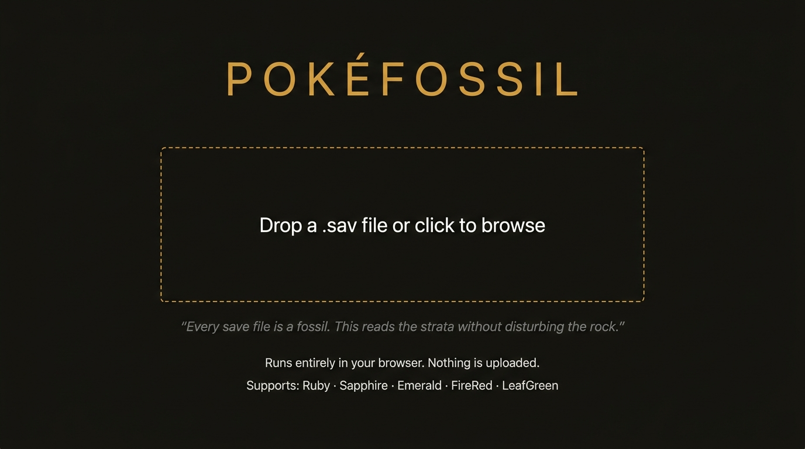
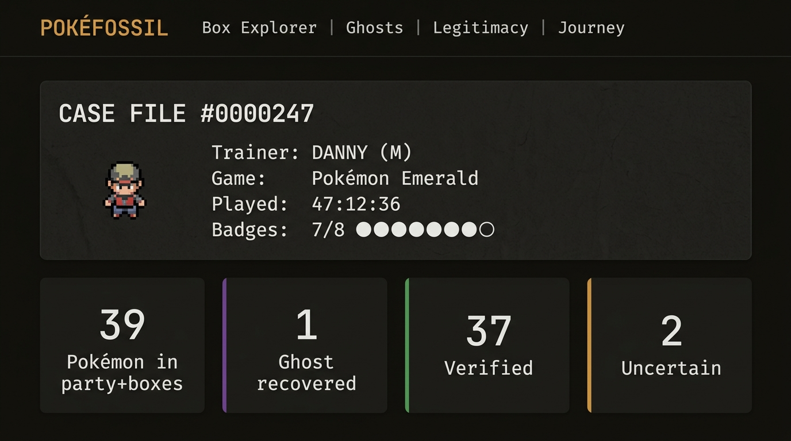
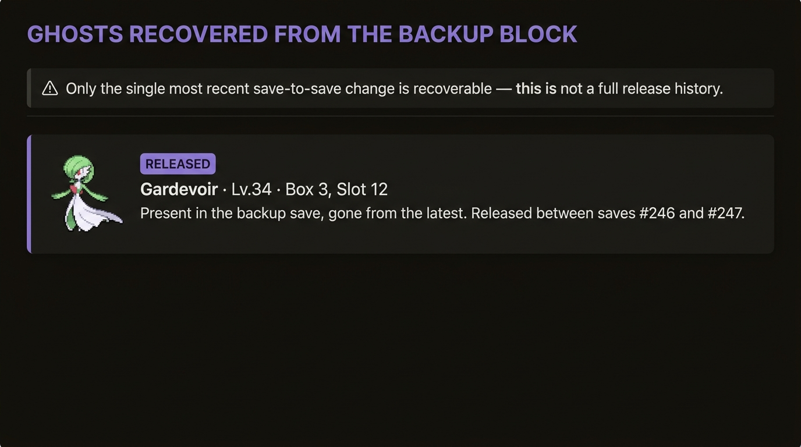
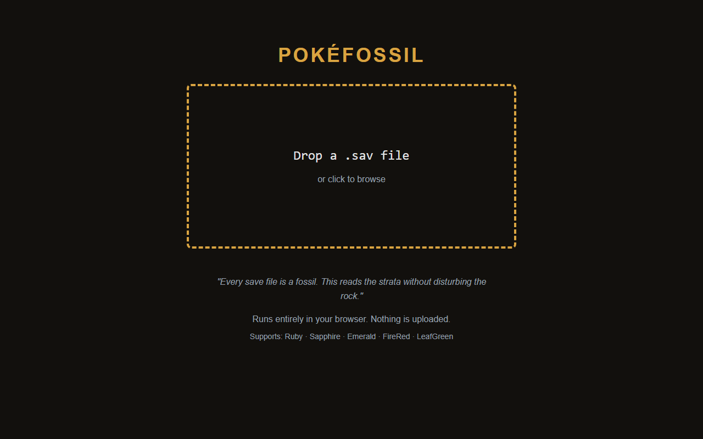

<div align="center">

  

  # 🦴 PokéFossil

  ### *The Pokémon Save File Archaeologist*

  [](#tech-stack)
  [](#tech-stack)
  [](#tech-stack)
  [](#tech-stack)
  [](#license)
  [](#-privacy-guarantee)

  <br/>

  > *"Every save file is a fossil. This reads the strata without disturbing the rock."*

  <br/>

  **Drag. Drop. Discover what someone left behind.**

  PokéFossil performs forensic archaeology on Pokémon Generation III save files.
  It doesn't edit anything. It **excavates** — recovering ghost Pokémon,
  verifying legitimacy with RNG analysis, and reconstructing the journey
  of a trainer who may have put down their GBA years ago.

  <br/>

  [**Try It Live →**](https://nyx-abu.github.io/pokefossil) · [Report Bug](https://github.com/Nyx-abu/pokefossil/issues) · [Request Feature](https://github.com/Nyx-abu/pokefossil/issues)

</div>

---

## 📸 Screenshots

<div align="center">

| Drop Zone | Case File Dashboard |
|:---------:|:-------------------:|
|  |  |

| Ghost Gallery | Real App (Landing Page) |
|:------------:|:-----------------------:|
|  |  |

</div>

---

## ✨ What Can It Do?

### 👻 Ghost Recovery
When the game saves, it writes to one of two save blocks and keeps the other as a backup.
PokéFossil diffs the **active block** against the **inactive backup block** to find Pokémon
that were released or overwritten between the last two saves.

> *"You released your Gardevoir. The cartridge remembers."*

### 🕵️ Legitimacy Forensics
PokéFossil doesn't just say "hacked" or "legit." It uses a **3-tier confidence model**:

| Verdict | Meaning | Color |
|---------|---------|:-----:|
| **✓ Verified** | PID-IV match found via Method 1/2/4 LCRNG correlation. No red flags. | 🟢 |
| **? Uncertain** | No standard RNG pattern matched — but this happens with ~2-3% of legitimate wild encounters (Synchronize, Cute Charm). Not proof of tampering. | 🟡 |
| **✗ Likely Modified** | Bad Egg flag, checksum failure, or multiple independent red flags. | 🔴 |

Every verdict comes with its **full evidence trail** — PIDs, IVs, ability bits, checksums — so you can judge for yourself.

### 🗺️ Journey Estimate
Gen III save files store **no per-capture timestamps**. So PokéFossil doesn't pretend to know the exact order.
Instead, it builds a best-guess timeline using:
- **Met Level** + route progression order
- **Hall of Fame** records (hard checkpoints)
- **Badge flags** cross-referenced with capture locations
- **Starter detection** (species + met level 5 + starting town)

Every entry carries a confidence tag (High / Medium / Low) so you always know what's a fact vs. an educated guess.

### 📂 Box Explorer
A faithful 6×5 grid per box (exactly like the in-game layout) with:
- Verdict-colored dots on each Pokémon
- Level badges
- Click-to-inspect detail drawer with raw hex values in monospace

---

## 🎮 Supported Games

<div align="center">

| | Game | Region | Notes |
|:---:|------|--------|-------|
| 🔴 | **Ruby** | Hoenn | RTC-derived seed (dead battery → fixed `0x5A0`) |
| 🔵 | **Sapphire** | Hoenn | RTC-derived seed (dead battery → fixed `0x5A0`) |
| 🟢 | **Emerald** | Hoenn | Hardcoded seed `0x00000000` (Game Freak bug!) |
| 🟠 | **FireRed** | Kanto | Timer1-based seed, Security Key encrypted |
| 🟤 | **LeafGreen** | Kanto | Timer1-based seed, Security Key encrypted |

</div>

---

## 🔬 How It Works Under the Hood

PokéFossil doesn't use any server or API. It reads the raw 128 KB binary directly in your browser using `ArrayBuffer` and `DataView`.

```
128 KB Save File
├── Block A (14 sections × 4,096 bytes)
├── Block B (14 sections × 4,096 bytes)  ← backup block for ghost recovery
├── Hall of Fame
├── Mystery Gift
└── Recorded Battle
```

**For each of the 28 sections**, PokéFossil:
1. Validates the **signature** (`0x08012025`)
2. Computes the **checksum** (32-bit word sum, folded to 16-bit)
3. Falls back to the other block if the latest one is corrupted — just like the real game does

**For each Pokémon**, it:
1. Decrypts the 48-byte substructure block using `PID ⊕ OTID`
2. Unshuffles the 4 substructures (Growth/Attacks/EVs/Misc) using `PID % 24`
3. Extracts IVs, nature, ability, met data
4. Reverse-engineers the **LCRNG seed** from the PID (brute-force 65,536 candidates)
5. Tests against **Method 1, 2, and 4** RNG patterns to determine legitimacy

---

## 🔒 Privacy Guarantee

**Nothing leaves your browser. Ever.**

- No server calls
- No analytics
- No cookies
- The `.sav` file is read with `FileReader` into an `ArrayBuffer` and parsed entirely in JavaScript
- You can disconnect from the internet before dropping your file. It still works.

---

## 🛠️ Tech Stack

| Layer | Technology | Why |
|-------|-----------|-----|
| Language | **TypeScript** | Type safety for binary parsing |
| Framework | **React 18** | Component model for complex UI |
| Build | **Vite** | Sub-second HMR |
| Styling | **Tailwind CSS v4** | Utility-first, matches forensic design tokens |
| State | **Zustand** | Lightweight, no boilerplate |
| Binary Parsing | **Native DataView/ArrayBuffer** | Zero dependencies for the core parser |
| Testing | **Vitest** | Fast unit tests with fixture-based checksum validation |

---

## 🚀 Getting Started

```bash
# Clone the repo
git clone https://github.com/Nyx-abu/pokefossil.git

# Install dependencies
cd pokefossil
npm install

# Start the dev server
npm run dev
```

Then open **http://localhost:5173** and drag your `.sav` file into the drop zone.

### Building for Production

```bash
npm run build    # TypeScript check + Vite production build
npm run preview  # Preview the production build locally
```

---

## 📁 Project Structure

```
pokefossil/
├── src/
│   ├── parser/           # 🧬 The core binary engine
│   │   ├── checksum.ts   # §2.2.1 — Section checksum validation
│   │   ├── parser.ts     # §2.3  — Block selection & save file parsing
│   │   ├── pokemon.ts    # §3    — Pokémon data structure decryption
│   │   ├── crypto.ts     # §3.2  — PID⊕OTID XOR decryption
│   │   ├── charset.ts    # §2.7  — Gen III character set decoder
│   │   ├── prng.ts       # §4    — LCRNG engine & seed reconstruction
│   │   ├── forensics.ts  # §5.3  — PID-IV Method 1/2/4 & 3-tier verdicts
│   │   ├── ghosts.ts     # §5.2  — Ghost recovery (block diffing)
│   │   ├── timeline.ts   # §5.4  — Journey estimation
│   │   └── types.ts      # Type definitions
│   ├── components/       # 🎨 React UI components
│   │   ├── DropZone.tsx
│   │   ├── Dashboard.tsx
│   │   ├── BoxExplorer.tsx
│   │   ├── GhostGallery.tsx
│   │   ├── LegitimacyReport.tsx
│   │   └── JourneyEstimate.tsx
│   ├── store.ts          # Zustand state management
│   ├── App.tsx
│   ├── main.tsx
│   └── index.css         # Tailwind + forensic design tokens
├── docs/images/          # README screenshots & mockups
└── ...config files
```

---

## 🎨 Design Philosophy

The UI is themed as a **forensic evidence room**, not a Pokédex app. The player's save file
is a piece of physical evidence being examined under a desk lamp.

| Token | Value | Purpose |
|-------|-------|---------|
| Background | `#12100D` | Near-black charcoal — warmth, not sterility |
| Accent | `#D9A441` | Sepia/amber — evidence tags, old photographs |
| Verified | `#5FA777` | Muted forensic green |
| Uncertain | `#D9A441` | Same amber as accent — deliberately non-alarming |
| Likely Modified | `#C1554B` | Muted red — concern without panic |
| Ghost | `#8C7BC4` | Violet — visually distinct from verdict colors |

Hex values and PIDs render in **monospace** (JetBrains Mono). UI text renders in **Inter**.
The distinction tells users: *"this number came directly off the cartridge."*

---

## 🆚 How It Compares

| Feature | PokéFossil | PKHeX | PokéFinder |
|---------|:----------:|:-----:|:----------:|
| Reads Gen III saves | ✅ | ✅ | ❌ |
| Edits Pokémon | ❌ (by design) | ✅ | ❌ |
| Ghost recovery (released Pokémon) | ✅ | ❌ | ❌ |
| Journey reconstruction | ✅ | ❌ | ❌ |
| PID-IV legitimacy check | ✅ (3-tier) | ✅ (binary) | ✅ (forward) |
| Runs in browser | ✅ | ❌ | ❌ |
| Zero uploads | ✅ | N/A | N/A |
| Treats saves as archaeology | ✅ | ❌ | ❌ |

---

## 🗺️ Roadmap

- [ ] GitHub Pages deployment
- [ ] PokeSprite integration (MIT-licensed Gen III sprites)
- [ ] PNG/JSON export of case files
- [ ] Hall of Fame timeline integration
- [ ] Party Pokémon support (100-byte extended structure)
- [ ] Game auto-detection (Ruby/Sapphire vs Emerald vs FRLG)
- [ ] Security Key decryption for Emerald/FRLG money & items
- [ ] Mobile-responsive layout (3-column box grid under 640px)

---

## 📖 References & Credits

- [Bulbapedia — Save data structure (Generation III)](https://bulbapedia.bulbagarden.net/wiki/Save_data_structure_(Generation_III))
- [Bulbapedia — Pokémon data structure (Generation III)](https://bulbapedia.bulbagarden.net/wiki/Pok%C3%A9mon_data_structure_(Generation_III))
- [pret/pokeemerald](https://github.com/pret/pokeemerald) — Decompilation reference
- [PokeFinder](https://github.com/Admiral-Fish/PokeFinder) — RNG method implementations
- [PokeSprite](https://github.com/msPokemon/pokesprite) — Sprite assets (MIT)

---

## 📄 License

MIT © [Nyx-abu](https://github.com/Nyx-abu)

This project is not affiliated with Nintendo, Game Freak, or The Pokémon Company.
Pokémon and all related marks are trademarks of their respective owners.

---

<div align="center">

  *Found an old cartridge? Dump the save. Drop it here. See what they left behind.*

  <br/>

  
  
  
  
  

  <sub>Built with ❤️ for Pokémon archaeologists everywhere.</sub>

</div>
